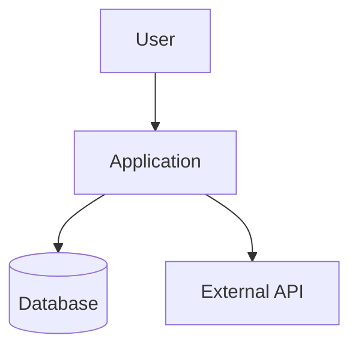
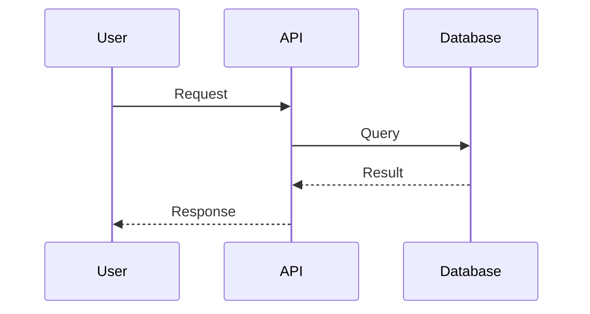
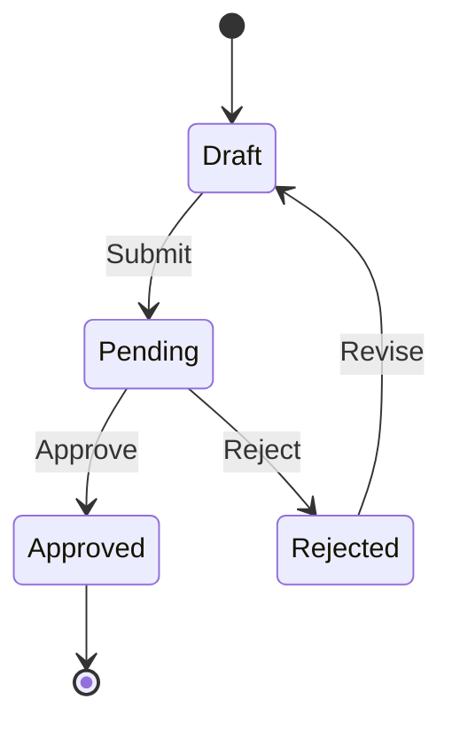
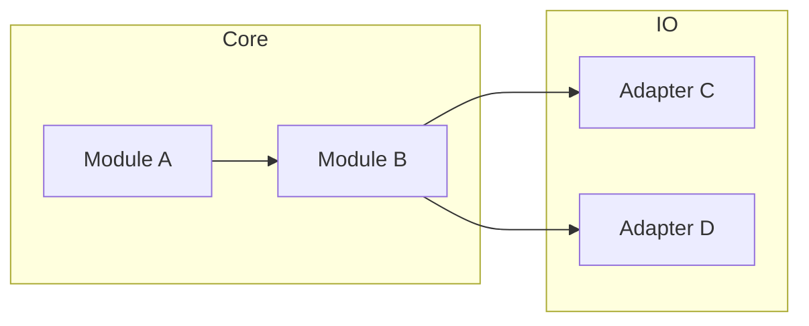
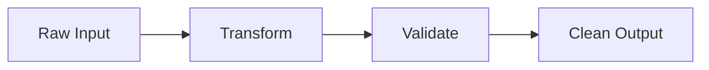

# Design Spec (The "How It Works")

> **Usage:** Create visual diagrams for complex flows using Mermaid.js syntax.
> **When Required:** Multi-step interactions, entity lifecycles, system boundaries.
> **Pragmatism:** Skip this file if diagrams add no value for simple tasks.

---

## 1. System Context Diagram

High-level view of system boundaries and external actors.

---

## 2. Sequence Diagrams

For multi-step interactions (User -> API -> DB).

### [Flow Name]

### [Add additional flows as needed]

---

## 3. State Diagrams

For entities with complex lifecycles.

### [Entity Name] Lifecycle

### [Add additional state machines as needed]

---

## 4. Component Diagram

Optional: For modular architecture showing dependencies.

---

## 5. Data Flow Diagram

Optional: For understanding data transformations.

---

## Notes

- Keep diagrams focused and readable
- One concept per diagram
- Update diagrams when implementation diverges
- Reference diagrams in `requirements.md` where relevant
